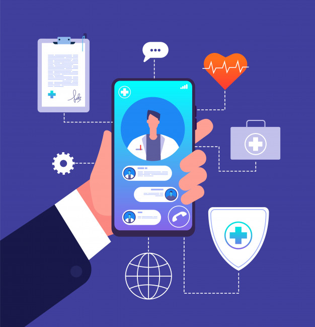
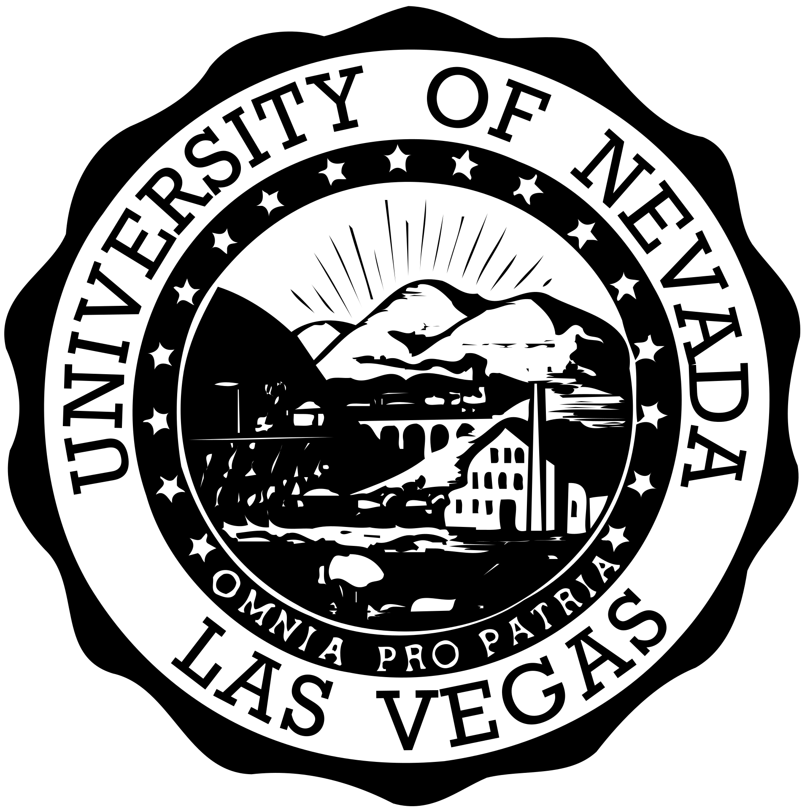

   
  
  

# Telemedicine Application

Project Owner: Phillipe Austria - Research Assistant

Advisor: Dr. Yoohwan Kim - Associate Professor

Howard Hughes College of Engineering, Computer Science Department

The University of Nevada, Las Vegas

## Project Description
This is a video chat based application for doctors and patients to have a virtual appointment. It uses WebRTC and socket.io to establish and allow for video/audio data streaming.

## Architecure

## How to Build
